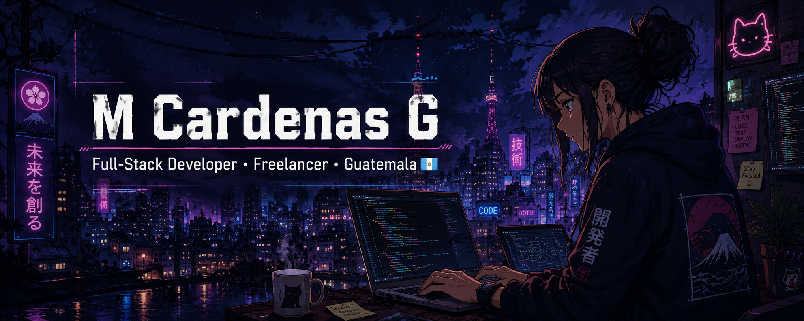

<div align="center">



<br>

<h1>M Cardenas G</h1>

<h3>Full-Stack Developer · Freelancer · Systems Engineering Student</h3>

<p>
  Guatemala
</p>


</div>

---

## About Me

```javascript
const developer = {
  name: "M Cardenas G",
  location: "Guatemala",
  role: "Full-Stack Developer",
  occupation: "Freelancer",
  studies: "Systems Engineering",

  languages: [
    "Spanish",
    "English"
  ],

  interests: [
    "Frontend Development",
    "Backend Development",
    "Web Applications",
    "New Technologies",
    "Building Projects"
  ]
};
```

I'm a **Full-Stack Web Developer from Guatemala**, currently studying **Systems Engineering** and working as a **freelancer**.

I enjoy working across the full web stack, from building modern and intuitive frontend interfaces to developing backend services, APIs and databases.

I'm always interested in learning new technologies, improving my skills and turning ideas into functional software.

---

## Tech Stack

<div align="center">

<h3>Frontend</h3>


<br><br>

<h3>Backend & Database</h3>


<br><br>

<h3>Tools & Environment</h3>


</div>

<br>

<div align="center">

`React` · `Angular` · `JavaScript` · `HTML5` · `CSS3`

`Node.js` · `Python` · `PostgreSQL`

`Docker` · `Linux` · `Git`

</div>

---

## Featured Projects

<table>
<tr>

<td width="33%" valign="top">

<h3>PROJECT_1</h3>

<a href="PROJECT_1_URL">
<strong>PROJECT_1_NAME</strong>
</a>

<br><br>

Short description of the project.

Explain what the project does, the problem it solves or its main functionality.

<br><br>

<strong>Stack</strong>

<br><br>

<code>TECH_1</code>
<code>TECH_2</code>
<code>TECH_3</code>

<br><br>

<a href="PROJECT_1_URL">View Repository →</a>

</td>

<td width="33%" valign="top">

<h3>PROJECT_2</h3>

<a href="PROJECT_2_URL">
<strong>PROJECT_2_NAME</strong>
</a>

<br><br>

Short description of the project.

Explain what the project does, the problem it solves or its main functionality.

<br><br>

<strong>Stack</strong>

<br><br>

<code>TECH_1</code>
<code>TECH_2</code>
<code>TECH_3</code>

<br><br>

<a href="PROJECT_2_URL">View Repository →</a>

</td>

<td width="33%" valign="top">

<h3>PROJECT_3</h3>

<a href="PROJECT_3_URL">
<strong>PROJECT_3_NAME</strong>
</a>

<br><br>

Short description of the project.

Explain what the project does, the problem it solves or its main functionality.

<br><br>

<strong>Stack</strong>

<br><br>

<code>TECH_1</code>
<code>TECH_2</code>
<code>TECH_3</code>

<br><br>

<a href="PROJECT_3_URL">View Repository →</a>

</td>

</tr>
</table>

<div align="center">

<sub>More projects coming soon.</sub>

</div>

---

## GitHub Statistics

<div align="center">


<br>


</div>

---

## Developer Profile

```yaml
developer:
  name: M Cardenas G
  location: Guatemala

  profession:
    - Full-Stack Developer
    - Freelancer

  education:
    - Systems Engineering

  languages:
    - Spanish
    - English

  focus:
    - Frontend Development
    - Backend Development
    - Web Applications
    - Software Development

  status:
    learning: true
    building: true
    improving: true
```

---

## Development Environment

```text
WEB DEVELOPMENT
│
├── Frontend
│   ├── React
│   ├── Angular
│   ├── JavaScript
│   ├── HTML5
│   └── CSS3
│
├── Backend
│   ├── Node.js
│   └── Python
│
├── Database
│   └── PostgreSQL
│
└── Environment
    ├── Docker
    ├── Linux
    └── Git
```

---

## Connect With Me

<div align="center">

<a href="YOUR_GITHUB_PROFILE_URL">

</a>

<br><br>

I'm always interested in learning, building and exploring new ideas.

</div>

---

<div align="center">

<h3>Build · Learn · Create · Improve</h3>

<p>
<strong>M Cardenas G</strong>
</p>

<p>
Full-Stack Developer · Freelancer<br>
Guatemala
</p>

<sub>Code. Create. Improve. Repeat.</sub>

</div>
